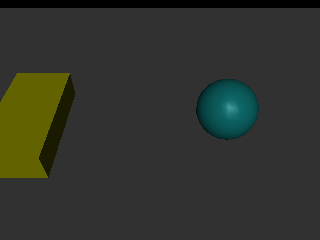
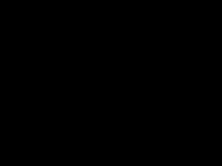

# Demo


## 初始化

> 以MuJoCo xml文件格式为基础，创建box和sphere作为示例。

```python
MODEL_XML1 ="""
<mujoco>
<option timestep="0.005" tolerance="1e-10" solver="Newton" jacobian="dense" cone="pyramidal"/>
<worldbody>
    <geom type="plane" size="1 1 .1"/>

    <body pos="0.22 0 0.1" name="body1">
        <freejoint/>
        <geom mass="0.1" type="sphere" name="sf1" size="0.1" rgba='0.1 0.8 0.8 1'/>
    </body>
    <body pos="-0.22 0 0.05" name="body2">
        <freejoint/>
        <geom mass="0.1" type="box" name="sf2" pos="-0.22 0 0" size=".1 .2 0.05" rgba='1 1 0 1' />
    </body>
</worldbody>

</mujoco>
"""
```

> simulate与OpenAI mujoco-py调用相同。

```python
import mujoco_webpy 
import os

model = mujoco_webpy.load_model_from_xml(MODEL_XML1)
# model = mujoco_webpy.load_model_from_path(xml_path)
sim = mujoco_webpy.MjSim(model)
sim.step()

print(sim.data.qpos)
```

返回：

    [ 0.22        0.          0.09975475  1.          0.          0.
      0.         -0.22        0.          0.04975475  1.          0.
      0.          0.        ]


## 保存图片

> 如果需要用到此功能，请确保环境包含PIL图像库。

```python
from mujoco_webpy.mjviewer import MjWebViewerBasic

webviewer = MjWebViewerBasic(sim)

sim.step()

array, image = webviewer._rgbflow()

image
```
返回：





!> 注意输出的array的shape为(Height, Width, Channel), 输出的image的size为(width, Height).更改width和height参见[API](document/api/api_01.md)

```python
print("image.size =", image.size, "\n",   # w * h
      type(array),"\n", 
      "array.shape =", array.shape        # h * w * c
     )
```
返回：

    image.size = (320, 240) 
     <class 'numpy.ndarray'> 
     array.shape = (240, 320, 3)


## 保存视频

!> 如果需要用到此功能，请确保环境包含opencv, ffmpeg。

```python
from mujoco_webpy.mjviewer import MjWebViewerBasic


model = mujoco_webpy.load_model_from_xml(MODEL_XML1)
sim = mujoco_webpy.MjSim(model)


webviewer = MjWebViewerBasic(sim)
sim.reset()

buffer = []
for i in range(100):
    # add code here.
    webviewer._move_cam(move_action=5, dx= 0.00, dy=-0.005, track_flag=1, track_id=2)
    
    img_rgb, _ = webviewer._rgbflow()
    buffer.append(img_rgb)
    sim.step()

webviewer.save_ori_video(camera_specs=buffer, filename="test.mp4")
```
返回：

    video record -> Done.


```python
from IPython.display import Video

Video("test.mp4")
```
返回：

<!-- <video width="320" height="240" controls="controls"> 
  <source src="images/openaitest.mp4" type="video/mp4" >
</video>
 -->




## mujoco-py渲染方式

> mujoco-py采用本地资源在本地模拟计算渲染方式。

```python
%%time

import mujoco_webpy as mujoco_py
from mujoco_webpy import MjViewer
model = mujoco_py.load_model_from_xml(MODEL_XML1)
sim = mujoco_py.MjSim(model)

viewer = MjViewer(sim)

sim.reset()
for i in range(100):
    sim.step()    
    ##################
    # your code here.#
    ##################
    viewer.render()
```

    Creating window glfw
    CPU times: user 1.4 s, sys: 127 ms, total: 1.53 s
    Wall time: 830 ms


## mujoco-webpy渲染方式

> mujoco-webpy采用集群资源模拟计算，在前端渲染方式。**仅仅需要更改一行代码**。

```python
%%time
import mujoco_webpy
from mujoco_webpy.mjviewer import MjWebViewerBasic

model = mujoco_webpy.load_model_from_xml(MODEL_XML1)
sim = mujoco_webpy.MjSim(model)

viewer = MjWebViewerBasic(sim)

sim.reset()
for i in range(100):
    sim.step()
    ##################
    # your code here.#
    ##################
    viewer.webrender()   # use webrender() instead of render()
    

```

    CPU times: user 38.5 ms, sys: 24 ms, total: 62.5 ms
    Wall time: 63.7 ms


## 设置物理参数

> 设置mujoco原有界面的22个物理参数。

!> 若对应的value为str，应该传入int参数。如name: collision, value: [all, predefined, dynamic], 对应传入0, 1, 2。


```python
"""
Support parameters list:

Physics para: 'integrator','collision','cone','jacobian','solver'

Algorithmic para: 'timestep','iterations','tolerance','noslip_iterations',
                  'noslip_tolerance','mpr_iterations','mpr_tolerance','apirate'

Physical para: 'gravity','wind','magnetic','density','viscosity','impratio'

Contact Override: 'o_margin','o_solimp','o_solref'
"""


viewer.set_physics_para("gravity", [0,0,-9.7])
# or
sim.model.opt.gravity[:] = [0, 0, -9.7]
```
返回：

    Set gravity -> [0, 0, -9.7]. 

